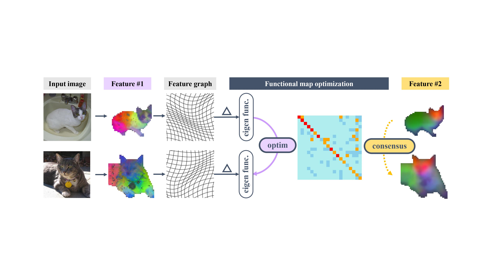

# Image Feature Consensus with Deep Functional Maps
This repository is the official implementation of the paper [“Zero-Shot Image Feature Consensus with Deep Functional Maps”](https://arxiv.org/abs/2403.12038).


## Overview



## Environment Set Up
We recommend the following commands to set up the environment.

```bash
pip install -r requirements.txt
pip install -e .
```
## Data Preparation
- TSS
```bash
sh tss.sh
```
- SPair-71k
```bash
sh spair.sh
```
## Evaluations
To reproduce the main results, run
```bash
sh run_fmap_pascal.sh
sh run_fmap_JODS.sh
sh run_fmap_FG3DCAR.sh
```

## TODOS
- [ ] Release SPair-71k Evaluation code.
- [ ] Release more results for TSS.

## Citation

If you find this repo useful or relevant to your project and research, please kindly cite our paper:

```bibtex
@misc{cheng2024zeroshot,
      title={Zero-Shot Image Feature Consensus with Deep Functional Maps}, 
      author={Xinle Cheng and Congyue Deng and Adam Harley and Yixin Zhu and Leonidas Guibas},
      year={2024},
      eprint={2403.12038},
      archivePrefix={arXiv},
      primaryClass={cs.CV}
}
```